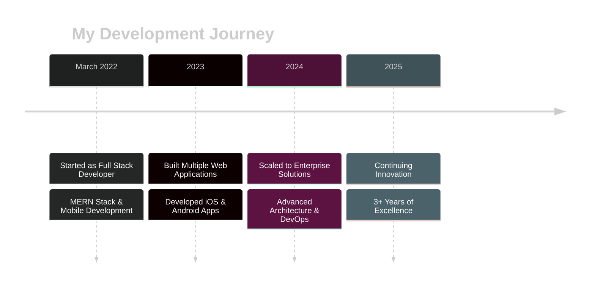

<div align="center">
  
# 👋 Hi there, I'm Vipin Nagar

### Full Stack Developer | MERN Stack Expert | Mobile App Developer


</div>

<div align="center">

[](YOUR_LINKEDIN_URL)
[](YOUR_PORTFOLIO_URL)
[](YOUR_TWITTER_URL)
[](mailto:YOUR_EMAIL)

</div>

---

## 💼 Professional Journey

<div align="center">



</div>

<div align="center">

| 📅 Started | 🎯 Focus Areas | 💪 Experience |
|-----------|---------------|---------------|
| March 2022 | MERN Stack, iOS, Android | 3+ Years |

</div>

---

## 👨‍💻 About Me

Hi there! I'm a passionate and dedicated developer with expertise in the **MERN stack** and **mobile application development** for both iOS and Android. With a strong foundation in full-stack web development and a knack for creating intuitive and dynamic mobile apps, I strive to deliver high-quality, user-centric solutions.

- 🔭 Currently working on full-stack web and mobile applications
- 🌱 Constantly learning and exploring new technologies
- 💡 Love building products that solve real-world problems
- 🎯 Focused on writing clean, maintainable, and scalable code
- 📱 Published 15+ apps on Google Play Store and Apple App Store

---

## 🚀 Tech Stack

### Frontend Development


### Backend Development


### Mobile Development


### Database


### DevOps & Tools


### Design & Others


---

## 📱 Published Mobile Applications

<div align="center">

### 🏥 Healthcare & Wellness Apps

</div>

<table>
<tr>
<td width="50%">

### 🍃 [Aaranya Wellness - Healer](https://play.google.com/store/apps/details?id=com.aaranyawellnessuser)


Comprehensive wellness platform for healers providing non-invasive therapies using Acupressure and Sujok. Manages appointments, client records, and therapy sessions for 300+ wellness consultants.

**Tech Stack:** React Native, Redux, Firebase, Node.js

**Key Features:**
- Appointment scheduling & management
- Client health tracking
- Therapy session records
- Real-time notifications

[](https://play.google.com/store/apps/details?id=com.aaranyawellnessuser)

</td>
<td width="50%">

### 🍃 [Aaranya Wellness](https://play.google.com/store/apps/details?id=com.AaranyaWellness)


Patient-facing wellness app for booking holistic healing therapies. Connects users with certified wellness consultants for treating muscular pain, stress, BP, diabetes through natural therapies.

**Tech Stack:** React Native, Redux, Firebase, REST API

**Key Features:**
- Book therapy sessions
- Track wellness progress
- Access healing resources
- Personalized health plans

[](https://play.google.com/store/apps/details?id=com.AaranyaWellness)

</td>
</tr>
</table>

<table>
<tr>
<td width="33%">

### 🍃 [Aaranya Wellness - Healer (iOS)](https://apps.apple.com/us/app/aaranya-wellness-healer/id6747748589)


iOS version of the healer app with native performance and seamless UX for wellness consultants.

**Tech:**  React Native, Redux, Firebase, Node.js

[](https://apps.apple.com/us/app/aaranya-wellness-healer/id6747748589)

</td>
<td width="33%">

### 🍃 [Aaranya Wellness (iOS)](https://apps.apple.com/us/app/aaranya-wellness/id6747888428)


Patient app on iOS for booking natural healing therapies at workplace.

**Tech:** React Native, Redux, Firebase, Node.js

[](https://apps.apple.com/us/app/aaranya-wellness/id6747888428)

</td>
<td width="33%">

### 🍃 [Aaranya Healer (iOS)](https://apps.apple.com/us/app/aaranya-healer/id6752554015)


Enhanced healer management app with advanced features for therapy tracking.

**Tech:**  React Native, Redux, Firebase, Node.js

[](https://apps.apple.com/us/app/aaranya-healer/id6752554015)

</td>
</tr>
</table>

---

<div align="center">

### 🛒 E-Commerce Solutions

</div>

<table>
<tr>
<td width="50%">

### 🛍️ [OndjangoBay - Customer](https://play.google.com/store/apps/details?id=com.ondjangobay.customer)


Full-featured e-commerce marketplace connecting buyers with verified vendors. Shop fashion, electronics, home essentials with secure payments and fast shipping.

**Tech Stack:** React Native, Redux Toolkit, Node.js, MongoDB

**Key Features:**
- Browse thousands of products
- Secure multi-gateway payments
- Real-time order tracking
- Wishlist & personalized recommendations
- 24/7 customer support

[](https://play.google.com/store/apps/details?id=com.ondjangobay.customer)

</td>
<td width="50%">

### 💼 [OndjangoBay - Vendor](https://play.google.com/store/apps/details?id=com.ondjangobay.vendor)


Powerful vendor management platform for online sellers. Manage products, track orders, monitor inventory, and analyze sales performance.

**Tech Stack:** React Native, Redux, Express.js, MongoDB

**Key Features:**
- Product catalog management
- Real-time order notifications
- Inventory tracking & alerts
- Sales analytics dashboard
- Revenue reporting

[](https://play.google.com/store/apps/details?id=com.ondjangobay.vendor)

</td>
</tr>
</table>

---

<div align="center">

### 📊 Enterprise & Productivity Apps

</div>

<table>
<tr>
<td width="50%">

### 🌾 [Farmers Survey](https://play.google.com/store/apps/details?id=com.farmersurvey)


Data collection platform for agricultural sector. Conduct surveys, gather feedback, and analyze farming practices with offline support.

**Tech Stack:** React Native, Firebase, Express.js

**Key Features:**
- Custom survey creation
- Offline data collection
- Real-time response tracking
- Multi-language support
- Data visualization & export

[](https://play.google.com/store/apps/details?id=com.farmersurvey)

</td>
<td width="50%">

### 👥 [Employee Track](https://play.google.com/store/apps/details?id=com.employeetrack)


Comprehensive employee management solution for businesses. Track activities, monitor attendance, assign tasks, and manage projects.

**Tech Stack:** React Native, Redux, Node.js, MySQL

**Key Features:**
- Attendance monitoring
- Task assignment & tracking
- Project progress management
- Performance analytics
- Issue reporting system

[](https://play.google.com/store/apps/details?id=com.employeetrack)

</td>
</tr>
</table>

---

## 📊 GitHub Stats

<div align="center">
  


</div>

<div align="center">
  
[](https://git.io/streak-stats)

</div>

---

## 🏆 GitHub Trophies

<div align="center">
  
[](https://github.com/ryo-ma/github-profile-trophy)

</div>

---

## 🏅 GitHub Achievements

<div align="center">


</div>

---

## 🛠️ Languages and Tools

<p align="center">
  
</p>

---

## 📈 Contribution Graph

<div align="center">

[](https://github.com/ashutosh00710/github-readme-activity-graph)

</div>

---

## 💼 What I Do

```javascript
const vipin = {
    code: ["JavaScript", "TypeScript", "Swift", "Kotlin", "Python"],
    technologies: {
        frontEnd: {
            js: ["React", "Angular", "Redux", "jQuery"],
            css: ["TailwindCSS", "Material-UI", "Sass", "Bootstrap"]
        },
        backEnd: {
            js: ["Node.js", "Express", "GraphQL"],
        },
        mobile: ["React Native", "Flutter", "Swift", "Kotlin"],
        databases: ["MongoDB", "MySQL", "Redis", "Firebase"],
        devOps: ["Docker", "AWS", "Nginx", "GitHub Actions"],
        tools: ["Git", "Webpack", "Babel", "Postman", "Figma"]
    },
    architecture: ["Microservices", "RESTful APIs", "Single Page Applications", "Progressive Web Apps"],
    publishedApps: {
        android: 6,
        iOS: 3,
        total: 9
    },
    currentFocus: "Building scalable full-stack applications and mobile experiences"
};
```

---

## 🎯 Key Achievements

- 📱 **9+ Published Apps** across iOS and Android platforms
- 🏥 **Healthcare Solutions** serving 300+ wellness consultants
- 🛍️ **E-Commerce Platform** with dual-sided marketplace
- 🌾 **AgriTech Innovation** with offline-first data collection
- 👥 **Enterprise Solutions** for employee management
- ⭐ **3+ Years** of consistent full-stack development

---

## 🤝 Let's Connect

<div align="center">

I'm always open to interesting conversations and collaboration opportunities!

[](YOUR_LINKEDIN_URL)
[](YOUR_TWITTER_URL)
[](mailto:YOUR_EMAIL)

</div>

---

<div align="center">

### 💡 "Code is like humor. When you have to explain it, it's bad." – Cory House


⭐️ From [vipinnagar8700](https://github.com/vipinnagar8700)

</div>
